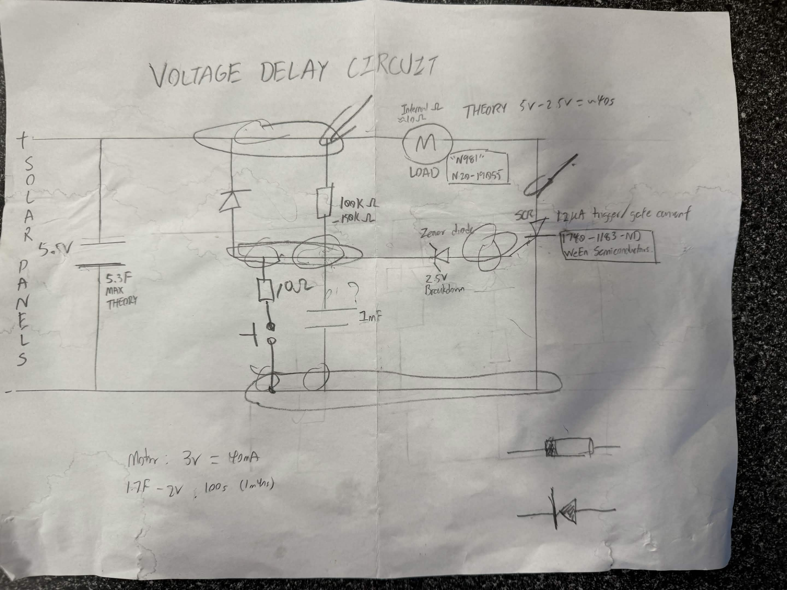
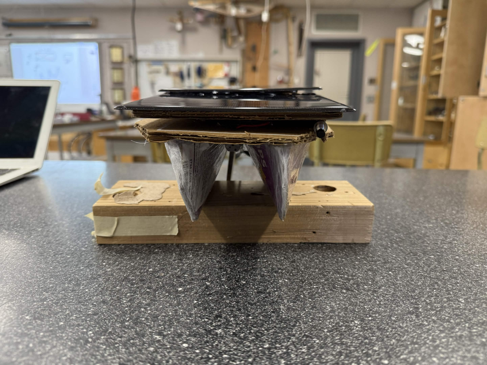

# Solar-Powered Prototype Vessel

This project was developed for the **UBC Physics Olympics**, where I served as the **Team Lead** for a 7-person team. The objective was to design and construct an autonomous vessel powered exclusively by real-time solar energy to navigate a test pool at maximum speed.

## Performance in Action

The vessel was tested in a **189 cm** long pool. Under standard competition light sources, the vessel achieved high-torque propulsion through a custom "burst" energy delivery system.

---

## Technical Architecture: Voltage Delay Circuit

The core innovation of this vessel is the **Voltage Delay Circuit**. Standard solar-to-motor connections often lack the torque to overcome initial water resistance. My design utilizes a "charge-and-release" mechanism to improve efficiency by **400%**.

### How it Works
* **Energy Collection**: Solar panels gather energy into a **5.3F (theory)** capacitor bank.
* **The Threshold Trigger**: A **2.5V Zener Diode** acts as a gatekeeper. It prevents the motor from drawing power until the capacitors have reached a sufficient voltage.
* **High-Torque Burst**: Once the threshold is met, a **Silicon Controlled Rectifier (SCR)** (1740-1183-ND) triggers, dumping the stored energy into the **N20-19055 motor**. This provides the high initial torque required for rapid acceleration.

---

## Hydrodynamic Design and Constraints

The vessel was constructed within strict material and dimensional limits:
* **Material Constraints**: Built using only wood, cardboard, and cling wrap.
* **Dimensions**: Stayed within the **25 cm x 15 cm x 25 cm** (LxWxH) limit.
* **Hull Geometry**: I designed a **dual-hull (catamaran) structure** to provide maximum stability for the large solar array while minimizing the wetted surface area to reduce drag.

---

## Engineering Process
* **Prototyping**: Led the team through **4 major prototyping cycles**, moving from basic buoyancy tests to the final SCR-integrated model.
* **Testing**: Conducted hydrodynamic trials to ensure the vessel remained stable and did not touch the bottom of the **30 cm deep** pool during operation.
* **Leadership**: Managed a **7-person team**, coordinating between circuit designers, hull builders, and testing leads.

---

## Repository Contents
* **/media**: Contains photos and videos of the circuit schematics, hull, and solar array.
* **/documentation**: Official competition rules and scoring parameters.
